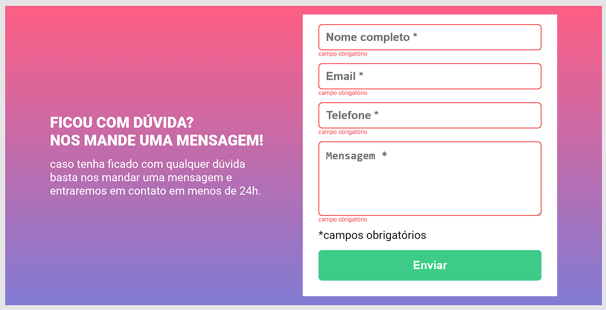
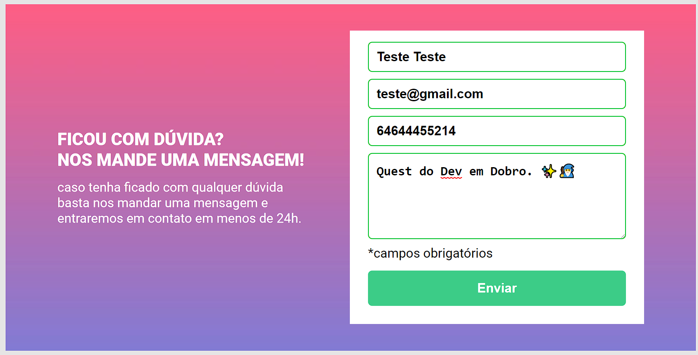

valid
focus.
# Formulario

## Sobre o projeto

Nesse projeto é uma Quest do Dev em Dobro. ✨🧙‍♂️

Nessa Qust eu realizei uma crição de um formulario usando html css e javascript.
#
## Objetivo da Quest

Criar uma validação quando click em enviar de um o formulario usando Javascript puro.
#
#### Preenche o formulário 

#### Formulário invalido

#### Formulário preenchido corretamente
